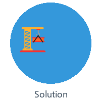
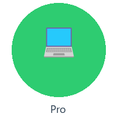
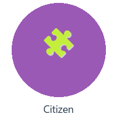
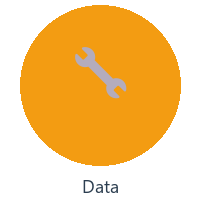

# Oracle AI Database@Azure — AI Adoption Playbook

---

<strong><a href="https://learn.microsoft.com/en-us/azure/oracle/oracle-db/database-overview">Oracle AI Database@Azure</a></strong> is an Oracle Database service running on Oracle Cloud Infrastructure (OCI), co-located inside Microsoft Azure data centers. It gives your Oracle workloads the fastest possible access to Azure resources — networking via Azure Virtual Network, identity via Microsoft Entra ID, monitoring via Azure Monitor, and billing through your existing Azure commitment (MACC-eligible). Infrastructure is managed by Oracle's operations team while you provision and manage through the Azure portal, APIs, SDKs, and Terraform.

<strong>This playbook shows you how to build AI agents, RAG solutions, and agentic AI systems on that foundation — using Copilot Studio, Microsoft Foundry, Oracle MCP, Microsoft Fabric, Power Apps, Logic Apps, and the Microsoft IQ intelligence layers.</strong>

---

## Who This Playbook Is For

This playbook is designed to serve **every persona** involved in bringing AI to Oracle AI Database@Azure — from a first customer conversation to a production-grade agentic system.

<table>
<tr>
<td align="center" width="170">
 
<strong>Field Seller</strong> 
Discovery, positioning, objection handling 
<a href="docs/01-field-playbook.md">Field Playbook →</a>
</td>
<td align="center" width="170">
 
<strong>Solution Architect</strong> 
14 blueprints, decision matrices, security 
<a href="docs/02-reference-architectures.md">Architectures →</a>
</td>
<td align="center" width="170">
 
<strong>Pro Developer</strong> 
MCP, Foundry agents, ORDS, multi-agent 
<a href="docs/05-oracle-mcp.md">Oracle MCP →</a>
</td>
<td align="center" width="170">
 
<strong>Citizen Developer</strong> 
Power Apps, Logic Apps, Copilot Studio 
<a href="docs/07-power-apps.md">Power Apps →</a>
</td>
<td align="center" width="170">
 
<strong>Data Engineer</strong> 
Fabric Mirroring, GoldenGate, Data Agents 
<a href="docs/06-fabric-data-agents.md">Data Agents →</a>
</td>
</tr>
</table>

---

## What's Available Today

Oracle AI Database@Azure integrates with the full Microsoft AI ecosystem. Here's what you can use **right now**:

### 🔌 Connectors & Protocols

- **Oracle Connector in Microsoft Copilot Studio** — no-code copilots that query live Oracle data via the On-Premises Data Gateway. Use Oracle as a **Knowledge** source or as a **Tool** (action-based queries) to ground your custom copilot ([details](docs/03-copilot-studio.md))
- **Managed Oracle MCP via Microsoft Foundry Catalog**  — discover and register Oracle's managed MCP server directly from the Foundry tool catalog. Zero infrastructure to deploy — Oracle manages the server, you build the agent ([details](docs/05-oracle-mcp.md))
- **Self-hosted Oracle MCP on Azure Functions / Container Apps** — full infrastructure control with VNET integration, Private Endpoints, and APIM governance ([details](docs/05-oracle-mcp.md))
- **Oracle MCP in VS Code** — SQLcl MCP Server for GitHub Copilot Agent Mode. Natural language → SQL in your editor ([details](docs/05-oracle-mcp.md))
- **Oracle Connector in Power Apps** — build model-driven and canvas apps connected to Oracle tables via the Data Gateway. Add AI Builder for predictions and form processing ([details](docs/07-power-apps.md))
- **Oracle Connector in Logic Apps** — event-driven workflows with 1400+ enterprise connectors. Trigger on Oracle changes, orchestrate across SaaS + Azure services ([details](docs/08-logic-apps.md))

---

## Pick Your Path

| You are a... | Start here  |
|---|---|
| **Field seller** preparing a customer meeting | [Field Playbook & Discovery](docs/01-field-playbook.md)  |
| **Solution architect** designing an integration | [Reference Architectures](docs/02-reference-architectures.md) |
| **Developer** who wants to try MCP right now | [Oracle MCP → VS Code setup](docs/05-oracle-mcp.md#deployment-option-1-local-mcp-via-vs-code-developer-productivity) |
| **Developer** who wants managed MCP (no infra) | [Foundry Catalog path](docs/05-oracle-mcp.md) |
| **Citizen developer** building a Custom Copilot | [Copilot Studio](docs/03-copilot-studio.md) |
| **Citizen developer** building a Power App | [Power Apps + Oracle](docs/07-power-apps.md)|
| **Data engineer** mirroring Oracle into Microsoft Fabric | [Microsoft Fabric Data Agents](docs/06-fabric-data-agents.md) |

---

## Repository Structure

This playbook is organized into modular documents under the [`docs/`](docs/) folder.

### Part I — Field Playbook

| # | Section | File |
|---|---------|------|
| 1 | How to Use This Playbook | [01-field-playbook.md](docs/01-field-playbook.md) |
| 2 | Customer Discovery Framework | [01-field-playbook.md](docs/01-field-playbook.md) |
| 3 | Core Positioning Message | [01-field-playbook.md](docs/01-field-playbook.md) |
| 4 | Decision Matrix | [01-field-playbook.md](docs/01-field-playbook.md) |
| 5 | Objection Handling | [01-field-playbook.md](docs/01-field-playbook.md) |
| 6 | Field Motion & Engagement Model | [01-field-playbook.md](docs/01-field-playbook.md) |

### Part II — Architecture & Implementation

| # | Section | File | Audience |
|---|---------|------|----------|
| 1 | Reference Architecture Blueprints | [02-reference-architectures.md](docs/02-reference-architectures.md) | Architects |
| 2 | Copilot Studio Blueprints | [03-copilot-studio.md](docs/03-copilot-studio.md) | Architects / Devs |
| 3 | Foundry Agents Blueprints | [04-foundry-agents.md](docs/04-foundry-agents.md) | Architects / Devs |
| 4 | Oracle MCP Server (All Deployment Options) | [05-oracle-mcp.md](docs/05-oracle-mcp.md) | Devs / Partners |
| 5 | Microsoft Fabric Data Agents & Mirroring | [06-fabric-data-agents.md](docs/06-fabric-data-agents.md) | Data Eng / Architects |
| 6 | Power Apps + Oracle | [07-power-apps.md](docs/07-power-apps.md) | Citizen Devs |
| 7 | Logic Apps + Oracle | [08-logic-apps.md](docs/08-logic-apps.md) | Integration / Devs |
| 8 | Microsoft IQ Layers  | [09-iq-work-unified.md](docs/09-iq-work-unified.md) | Architects / Devs |
| 9 | Security & Governance Guardrails | [10-security-governance.md](docs/10-security-governance.md) | All |
| 10 | Appendix — Resources & References | [12-appendix.md](docs/12-appendix.md) | All |
| 12 | Step-by-Step Implementation Guides  | ***(coming soon)*** | Devs / Partners |

---

## 🙏 Get Involved

We'd love to see you contributing to our repo and engaging with the experts with your questions!

- 🤔 Do you have suggestions or have you found spelling or code errors? [Raise an issue](https://github.com/OracleAIDatabase-Azure/Oracle-AI-Database-at-Azure/issues) or [Create a pull request](https://github.com/OracleAIDatabase-Azure/Oracle-AI-Database-at-Azure/pulls).
- 🚀 If you get stuck or have any questions, ask them in our [Discussions](https://github.com/OracleAIDatabase-Azure/Oracle-AI-Database-at-Azure/discussions).
- Check out [Contributing](CONTRIBUTING.md) & [Trademarks](TRADEMARKS.md) details.

---

  <em>Maintained by the Oracle AI Database@Azure AI PM team. 
  For contributions, corrections, or customer-specific architecture reviews, contact the authors.</em>

