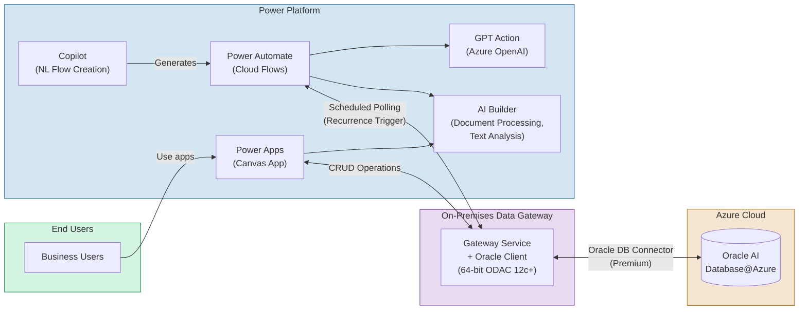

# Building Business Applications Using Power Apps + Power Automate on Oracle Data

## Architecture

Power Apps (comparable to Oracle APEX for low-code app building) and Power Automate connect to Oracle AI Database@Azure via the **Oracle Database connector** (a Premium connector) and the **On-Premises Data Gateway**, enabling business workflows with incremental AI capabilities.

## Setup Steps

1. **Set up On-Premises Data Gateway** (same as Path 1 -- see [Copilot Studio Prerequisites](03-copilot-studio.md#93-prerequisites))
   - Install the 64-bit Oracle Data Provider for .NET (ODAC 12c+) on the gateway machine ([Windows installer version required](https://www.oracle.com/technetwork/database/windows/downloads/index-090165.html); xcopy version does not work)
   - Set the environment variable `ORA_NCHAR_LITERAL_REPLACE=TRUE` on the gateway machine
2. **Create a Power App:**
   - Steps: https://learn.microsoft.com/en-us/power-apps/maker/canvas-apps/connections/connection-oracledb
   - Use the Oracle Database connector (**Premium** — requires Power Apps per-user or per-app plan)
   - Build forms, galleries, and screens connected to Oracle tables
3. **Add AI Builder:**
   - Document processing (OCR on uploaded images/PDFs — files stored in Oracle must be extracted via a Power Automate flow first)
   - Text classification and summarization
   - Object detection (works on images, not directly on database records)
4. **Create Power Automate flows:**
   - Poll Oracle data on a schedule (Recurrence trigger + Get rows action) — the Oracle connector **does not support event-based triggers**
   - Use Copilot in Power Automate for natural language flow creation
   - Chain with Azure AI services for enrichment

## AI Capabilities in Power Platform

| Capability | How It Works |
|--|--|
| **AI Builder** | Pre-built and custom AI models (document processing, text analysis, object detection). Note: prediction models have been retired. |
| **Copilot in Power Apps** | Natural language app building — currently generates apps from **Dataverse tables**; for Oracle tables, use the traditional canvas app builder to connect via the Oracle connector |
| **Copilot in Power Automate** | Describe a flow in English; Copilot builds it |
| **GPT action** | Call Azure OpenAI from within a flow for summarization, extraction |

## Known Limitations of the Oracle Database Connector

| Limitation | Details |
|--|--|
| **No triggers** | Only actions are supported (Get rows, Insert, Update, Delete). Use a Recurrence trigger to poll. |
| **No composite keys** | Tables with composite primary keys are not supported |
| **No nested objects** | Nested object types in tables are not supported |
| **Stored procedures** | OUT parameters and return values are not supported |
| **Response size limit** | 8 MB maximum response size |
| **Request size limit** | 2 MB maximum request size |
| **Timeout** | Queries or stored procedures exceeding 110 seconds will time out |
| **Schema name dependency** | Schema prefix is part of the table name — must match across environments (dev/staging/prod) |
| **Premium connector** | Requires a Power Apps per-user or per-app plan (not included in the base license) |

For the full list of limitations, see the [official Oracle Database connector reference](https://learn.microsoft.com/en-us/connectors/oracle/).
