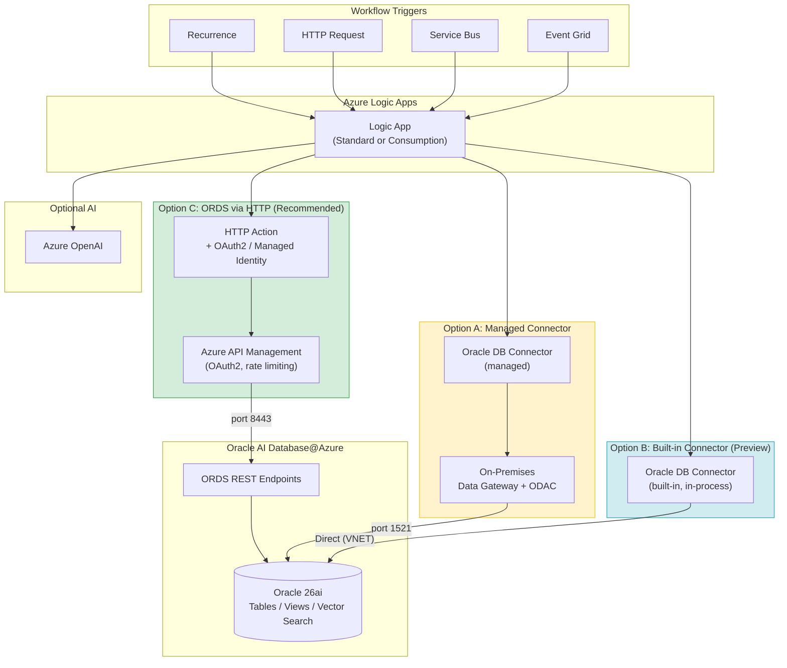
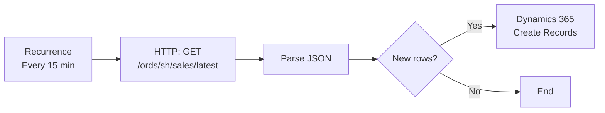
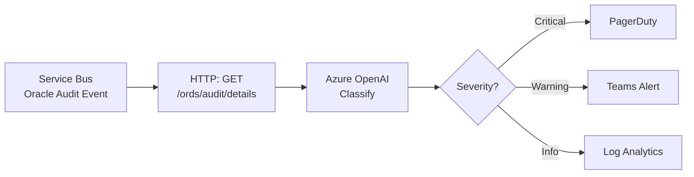
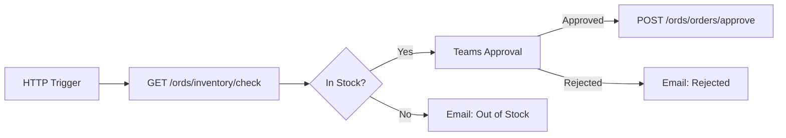

# Build Workflow Automation Using Azure Logic Apps + Oracle AI Database@Azure

## Overview

[Azure Logic Apps](https://learn.microsoft.com/en-us/azure/logic-apps/logic-apps-overview) is a low-code workflow platform with 1,400+ connectors. Combined with Oracle AI Database@Azure, it automates business processes that read, write, and orchestrate Oracle data -- without custom application code.

> **Important:** The Oracle Database connector provides **actions only -- no triggers**. Workflows must start with a non-Oracle trigger (Recurrence, HTTP, Service Bus, Event Grid, etc.) and then call Oracle actions. See [official connector docs](https://learn.microsoft.com/en-us/azure/connectors/connectors-create-api-oracledatabase).

### Quick Navigation

| Section | Description |
|--|--|
| [Option A: Managed Connector (Gateway)](#option-a-managed-oracle-connector-gateway-required) | Uses on-premises data gateway; works with Consumption and Standard |
| [Option B: Built-in Connector (Preview)](#option-b-built-in-oracle-connector-standard-only-preview) | In-process, no gateway; Standard only |
| [Option C: ORDS via HTTP (Recommended)](#option-c-ords-via-http-connector-recommended) | REST endpoints via APIM; most flexible |
| [Setup Guide (Option C)](#setup----option-c-ords-via-http) | Step-by-step for the recommended path |
| [Workflow Patterns](#common-workflow-patterns) | Reusable Mermaid blueprints |
| [Private Networking](#private-networking) | VNET, PE, and firewall controls |
| [Option Comparison](#option-a-vs-b-vs-c-comparison) | Side-by-side feature matrix |

### Common Scenarios: Logic Apps on Oracle Data

| # | Scenario | Industry | Oracle Tables Involved | Logic App Workflow |
|--|--|--|--|--|
| 1 | **Invoice Processing & AP Automation** | Finance | `AP_INVOICES`, `AP_INVOICE_LINES`, `PO_HEADERS` | Recurrence → poll new invoices from Oracle → validate against PO → route for approval in Teams → update Oracle status → post to Dynamics 365 GL |
| 2 | **Patient Appointment Reminders** | Healthcare | `APPOINTMENTS`, `PATIENTS`, `PROVIDERS` | Recurrence (daily 6 AM) → query tomorrow's appointments → call Azure Communication Services to send SMS/email reminders → log delivery status back to Oracle |
| 3 | **Supply Chain Inventory Alerts** | Manufacturing / Retail | `INVENTORY_LEVELS`, `PRODUCTS`, `WAREHOUSES` | Recurrence (every 30 min) → check items below reorder point → Azure OpenAI generates purchase recommendation → email procurement team → create reorder record in Oracle |
| 4 | **Regulatory Compliance Filing** | Insurance / Banking | `GL_BALANCES`, `JOURNAL_ENTRIES`, `FILING_SCHEDULES` | Event Grid trigger (file uploaded to Blob) → enrich with Oracle GL data via ORDS → transform to regulatory format → submit to filing API → update Oracle audit trail |
| 5 | **Customer Onboarding Pipeline** | SaaS / Telecom | `CUSTOMERS`, `SUBSCRIPTIONS`, `BILLING_ACCOUNTS` | HTTP trigger (CRM webhook) → create customer in Oracle → provision subscription → send welcome email → create Dynamics case for account manager |
| 6 | **Fraud Detection & Case Routing** | Banking | `TRANSACTIONS`, `RISK_SCORES`, `UNIFIED_AUDIT` | Recurrence → poll high-risk transactions → Azure OpenAI classifies fraud likelihood → route to investigator queue in ServiceNow → update Oracle case status |

### When to Use Logic Apps

| Use Case | Example |
|--|--|
| **Scheduled data sync** | Recurrence trigger polls Oracle --> sync to Dynamics 365, SAP, or ServiceNow |
| **Business process orchestration** | HTTP trigger (order received) --> validate inventory in Oracle --> ship --> notify |
| **Alert & notification** | Poll Oracle Unified Audit via ORDS --> Teams/email alert |
| **AI-augmented workflows** | Oracle data --> Azure OpenAI summarization --> write result back |
| **ETL / data movement** | Extract Oracle data --> transform --> load to Blob, Data Lake, or Fabric |
| **Approval workflows** | Poll pending records --> Teams approval --> update Oracle on decision |

--

## Architecture -- Three Connection Options



--

### Option A: Managed Oracle Connector (Gateway Required)

Uses the Oracle Database **managed connector** via an on-premises data gateway. Works with both Consumption and Standard Logic Apps.

**Supported actions:**

| Action | Description | Notes |
|--|--|--|
| `Get rows` | SELECT with OData filters | Requires primary key for paging |
| `Get row` | SELECT single row by key | |
| `Insert row` | INSERT into tables | Must provide explicit PK value |
| `Update row` | UPDATE by key | |
| `Delete row` | DELETE by key | |
| `Execute stored procedure` | Call PL/SQL procedures | OUT parameters **not supported** |
| `Execute a Oracle query` | Run native SQL | Gateway 3000.63.4+ required |

**Prerequisites:**
- On-premises data gateway on a VNET-integrated VM
- 64-bit Oracle Data Provider for .NET (ODAC 12c+, Windows installer -- xcopy won't work)
- Env var: `ORA_NCHAR_LITERAL_REPLACE=TRUE`
- [Azure gateway resource](https://learn.microsoft.com/en-us/azure/logic-apps/logic-apps-gateway-connection) created

**Key limitations:** No composite keys, no nested object types, 8 MB response / 2 MB request limits, 110-second timeout. See [full limitations](https://learn.microsoft.com/en-us/connectors/oracle/#known-issues-and-limitations).

--

### Option B: Built-in Oracle Connector (Standard Only, Preview)

Runs **in-process** with Logic Apps Standard runtime -- **no gateway or ODAC install required**. The Logic App must have network connectivity to the Oracle endpoint.

**Supported actions:**

| Action | Description | Notes |
|--|--|--|
| `Execute query` | Run arbitrary SQL | |
| `Execute stored procedure` | Call PL/SQL procedures | Supports result sets **and** output parameters |
| `Get rows` | SELECT with filtering, ordering, paging | |
| `Get tables` | List available tables | |
| `Insert row` | INSERT into tables | |

> No dedicated Update or Delete actions -- use `Execute query` or `Execute stored procedure` for those.

**Prerequisites:**
- Logic App Standard (single-tenant or ASEv3, Windows plans only)
- Oracle Database 11+
- Network path from Logic App to Oracle (VNET integration + private endpoint)

For setup details, see [Connect to Oracle databases from workflows in Azure Logic Apps](https://learn.microsoft.com/en-us/azure/connectors/connectors-create-api-oracledatabase).

--

### Option C: ORDS via HTTP Connector (Recommended)

Uses the HTTP action to call **ORDS REST endpoints** through Azure API Management. No gateway, no connector limitations -- supports any custom endpoint including vector search.

**Why recommended:**
- No gateway infrastructure to manage
- ORDS runs natively on Oracle 26ai
- APIM enforces OAuth2, rate limiting, and WAF
- Supports vector search endpoints (same as Blueprint 2)
- Managed Identity eliminates secrets management

**Prerequisites:**
- Logic App Standard with VNET integration
- ORDS enabled on Oracle 26ai with REST endpoints defined
- Azure API Management with OAuth2 validation
- Entra ID App Registration (or Managed Identity)

--

## Setup -- Option C (ORDS via HTTP)

### 1. Configure Logic App

1. Create a **Logic App Standard** in the same region as Oracle AI Database@Azure
2. Enable **VNET integration** --> select delegated subnet (`Microsoft.Web/serverFarms`)
3. Set `WEBSITE_VNET_ROUTE_ALL = 1`
4. Enable **system-assigned Managed Identity**

### 2. Build the Workflow

Choose a trigger:

| Trigger | Use Case |
|--|--|
| `Recurrence` | Scheduled polling |
| `HTTP Request` | Webhook from external systems |
| `Service Bus` | Event-driven (message on queue/topic) |
| `Event Grid` | Azure resource events |

Add an HTTP action to call ORDS via APIM (Managed Identity -- preferred):

```json
{
  "type": "Http",
  "inputs": {
    "method": "GET",
    "uri": "https://<apim-name>.azure-api.net/ords/sh/sales/summary",
    "authentication": {
      "type": "ManagedServiceIdentity",
      "audience": "<ords-app-registration-client-id>"
    }
  }
}
```

### 3. Add AI Processing (Optional)

Call Azure OpenAI to summarize or analyze Oracle data:

```json
{
  "type": "Http",
  "inputs": {
    "method": "POST",
    "uri": "https://<openai-resource>.openai.azure.com/openai/deployments/gpt-4.1/chat/completions?api-version=2025-04-01-preview",
    "body": {
      "messages": [
        {"role": "system", "content": "Summarize the following Oracle sales data"},
        {"role": "user", "content": "@{body('Parse_ORDS_Response')}"}
      ]
    },
    "authentication": {
      "type": "ManagedServiceIdentity",
      "audience": "https://cognitiveservices.azure.com"
    }
  }
}
```

### 4. Oracle Vector Search (Optional)

Call the vector search ORDS endpoint (same as Blueprint 2):

```json
{
  "type": "Http",
  "inputs": {
    "method": "POST",
    "uri": "https://<apim-name>.azure-api.net/ords/clinical_app/vectorsearch/search/",
    "body": {
      "p_query": "severe breathing complications",
      "p_top_k": 5
    },
    "authentication": {
      "type": "ManagedServiceIdentity",
      "audience": "<ords-app-registration-client-id>"
    }
  }
}
```

--

## Common Workflow Patterns

### Scheduled Oracle Data Sync



### AI-Augmented Alert Pipeline



### Approval Workflow with Oracle Write-Back



--

## Private Networking

All traffic between Logic Apps and Oracle should stay within the Azure backbone.

```
Logic App Standard (VNET-integrated, delegated subnet)
  --> Azure API Management (internal mode, VNET-injected)
    --> ORDS on Oracle 26ai (no public endpoint, port 8443)
      --> Oracle Database
```

**Key controls:**

| Control | Details |
|--|--|
| **Logic App VNET integration** | Outbound traffic routes through delegated subnet; no public IP |
| **APIM internal mode** | No public endpoint; Logic App reaches APIM via private IP |
| **Oracle ORDS -- private only** | Port 8443, public access disabled; NSG restricts to APIM subnet |
| **Private Endpoints** | Key Vault PE, Azure OpenAI PE -- all calls stay private |
| **Private DNS Zones** | `privatelink.oraclecloud.com`, `privatelink.vaultcore.azure.net`, `privatelink.openai.azure.com`, `privatelink.azure-api.net` |
| **Azure Firewall (enterprise)** | Hub-spoke topology with UDR for FQDN filtering and egress control |
| **Gateway VM (Option A only)** | VNET-deployed, no public IP; connects to Oracle via PE on port 1521 |

--

## Security

| Layer | Control |
|--|--|
| **Entra ID** | Managed Identity (preferred) or App Registration with OAuth2 client credentials |
| **APIM** | OAuth2 token validation + per-client rate limiting |
| **Oracle DB** | Dedicated least-privilege user per workflow; VPD row-level security; Data Redaction for PII |
| **Logic App** | Secrets stored in Key Vault, referenced via `@parameters()` |
| **Purview** | DLP + data classification on ORDS endpoints |

--

## Monitoring & Cost

| Control | Details |
|--|--|
| **Run history** | Built-in per-action input/output logs |
| **Log Analytics** | Diagnostics to shared Log Analytics workspace |
| **Alerts** | On failed runs, high-latency ORDS calls, throttled APIM requests |
| **Cost model** | Consumption: per-action billing; Standard: fixed ASP + per-execution |

--

## Option A vs B vs C Comparison

| Aspect | A: Managed (Gateway) | B: Built-in (Preview) | C: ORDS via HTTP |
|--|--|--|--|
| **Logic App type** | Consumption or Standard | Standard only | Standard (recommended) |
| **Setup effort** | Medium (gateway + ODAC) | Low (no gateway) | Low (existing ORDS + APIM) |
| **Infrastructure** | Gateway VM to patch | None (in-process) | None |
| **Stored procs** | No OUT params | OUT params supported | Via ORDS REST |
| **Vector search** | Not supported | Via `Execute query` | Native ORDS endpoints |
| **Security** | Gateway auth + DB creds | DB creds (user/pass or TNS+SSL) | OAuth2 + APIM + Managed Identity |
| **Recommended for** | Legacy, Consumption tier | Standard, direct SQL | Enterprise, governed, AI workflows |

--

## Combining with Other Patterns

| Combination | How It Works |
|--|--|
| **+ Foundry (Blueprint 2)** | Logic App triggers Foundry agent run via API; agent reasons over Oracle data via ORDS |
| **+ MCP (Blueprint 1)** | Logic App orchestrates workflows that include MCP tool calls for ad-hoc queries |
| **+ Copilot Studio (Blueprint 1)** | Logic App handles backend Oracle ops; Copilot Studio provides conversational UI |
| **+ Power Apps (Blueprint 6)** | Power App triggers Logic App flow for complex Oracle operations |
