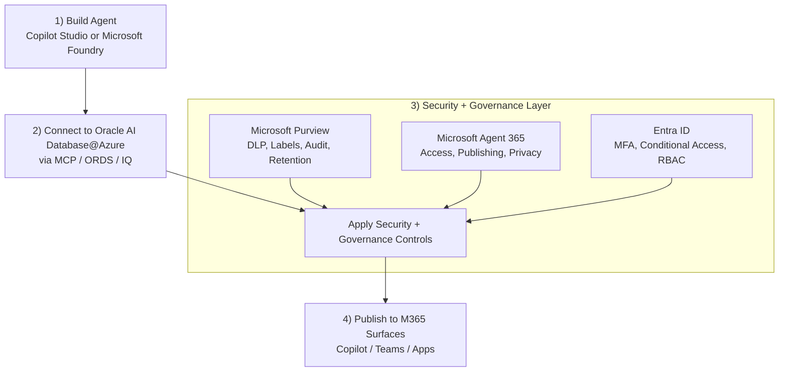
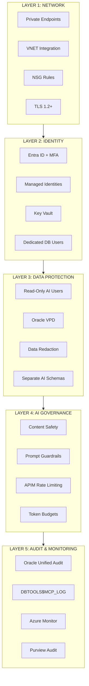

# Security, Governance, and Agent Controls for Oracle AI Database@Azure

## Microsoft Governance Context

Security for Oracle AI Database@Azure is not only a database or network concern. In Microsoft-centric agent architectures, governance spans the full lifecycle of the agent: how it is built, who can use it, what data it can ground on, what content it can return, and how all of that is audited over time.

This playbook maps Oracle-native controls such as dedicated database users, VPD, Data Redaction, Unified Audit, and private networking to Microsoft governance layers across [Microsoft Purview](https://learn.microsoft.com/en-us/purview/purview) and [Microsoft Agent 365](https://www.microsoft.com/en-us/microsoft-agent-365?msockid=04f94de6388d6f1021d95c3c3c8d69be).

- **Microsoft Purview** is the governance plane for classification, DLP, sensitivity labels, audit, retention, and compliance controls across Microsoft 365, Fabric, Foundry-connected content, and downstream agent outputs.
- **Microsoft Agent 365** is the operational control plane for agent access, publishing, Copilot controls, user entitlements, privacy boundaries, and tenant-level administration across agent experiences.
- **Oracle AI Database@Azure** remains the enforcement layer for data access itself: SQL privileges, row-level security, redaction, encryption, and Oracle audit stay in force regardless of whether the consumer is Copilot Studio, Foundry, Fabric, or a custom app.

> **Key design principle:** Oracle controls what data can be accessed; Purview governs how sensitive content is classified and protected; Agent 365 governs how agents are published, operated, and consumed.

## Governance Reference Architecture

The following diagram shows an agent built either in Copilot Studio or Microsoft Foundry, grounded on Oracle data, and governed by Microsoft Purview and Microsoft Agent 365.

In this sequential model, the flow is top-down: build the agent, connect Oracle data, enforce security and governance controls, then publish to user surfaces. Purview, Agent 365, and Entra ID are shown on the same security and governance layer feeding a single control gate before publication.

## Security Architecture

The security model is organized into five defense-in-depth layers. Each layer builds on the previous one -- all five must be in place for a production deployment.

### Layer Summary

| Layer | What It Protects | Key Controls |
|--|--|--|
| **1. Network** | Data in transit; attack surface | Private Endpoints (no public IP), VNET integration, NSG rules, TLS 1.2+ |
| **2. Identity** | Who/what can access | Entra ID + MFA, Managed Identities (no secrets), Key Vault, dedicated DB users per agent |
| **3. Data Protection** | What data is exposed | Read-only Oracle users, VPD row-level security, Data Redaction for PII, separate AI schemas |
| **4. AI Governance** | Agent behavior | Azure AI Content Safety, system prompt guardrails (no DDL/DML), APIM rate limiting, token budgets |
| **5. Audit** | Visibility and compliance | Oracle Unified Audit, DBTOOLS$MCP_LOG, Azure Monitor + Log Analytics, Purview audit trail |

## Security Checklist

| # | Control | Required | Notes |
|--|--|--|--|
| 1 | Dedicated read-only Oracle user per agent | Yes | Never use ADMIN/SYS |
| 2 | Private Endpoints for Oracle AI Database@Azure | Yes | No public IP |
| 3 | Entra ID auth for Azure services | Yes | Managed identities preferred |
| 4 | Key Vault for Oracle credentials | Yes | No plaintext secrets |
| 5 | System prompt restricts DDL/DML | Yes | Agent can only read by default |
| 6 | Column masking for PII | Recommended | Data Redaction for sensitive columns |
| 7 | MCP audit logging enabled | Yes | Check `DBTOOLS$MCP_LOG` |
| 8 | Rate limiting via APIM | Recommended | Prevents runaway agent queries |
| 9 | Azure AI Content Safety | Recommended | Filters harmful inputs/outputs |
| 10 | Network segmentation (NSGs) | Yes | Agent services in separate subnet |
| 11 | Encryption at rest and in transit | Yes | TLS 1.2+ for all connections; Oracle TDE |

## Key Principle

> **MCP does not bypass Oracle security -- it operates inside it.** Every SQL statement executed via MCP runs under the connected Oracle user's privileges, subject to Oracle's standard authentication, authorization, auditing, and VPD policies.
